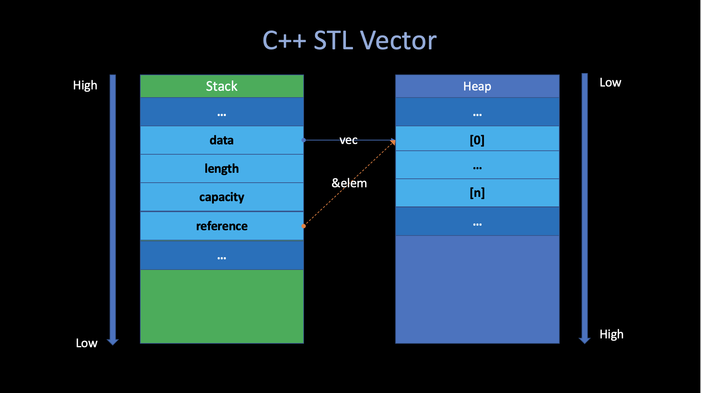

# The Rust Programming Language

##### Angold Wang | 2022-03-24

## 1. Why Rust? 

#### "Safe System Performance Programming"

* **System Programming Language:** _C, C++_.
* **Safe Programming Language:** _ML, Haskell, Java_

**Mozilla trying to blend the best of both of these languages**.

#### Why is Mozilla interested in creating a new programming language?
* Mozilla is the organization that created the Firefox web browser, current written in _C++_.
* **Web browsers need a high degree of control over the machine**.
    * Doing very complex tasks very quickly (all these tabs running simultaneously)
* **Web browsers need safety**
    * Running untrusted code, which is been downloaded from internet.
* **Languages like _C/C++_ that give you the kind of control you need in order to get the performance, but also leave you open to all kinds of security vulnerabilities.**
* Mozilla want to build the next generation web browser, which is a project called _[servo](https://github.com/servo/servo)_. And they wants to do it in a new language that tries to do better at giving you both **control** and **safety** at the same time.


## 2. Control - Case study: Zero-Cost Abstraction in C / C++

C and C++ is sort of the best existing language in this respect (control).

### i. Memory Allocation


Basically, there are **four** places in Memory for C/C++ program to store data.


#### 1. Stack

**Most of the temporary variables created at runtime are stored in the stack. They are created (push) when the corresponding procedure is called and destroyed (pop) when returns.**

Consider the following C code snippet:
```c
char s[] = "abc"; // {'a', 'b', 'c', 'd', '\n'}
char t[3] = "def";

printf("s: %s\n", s);
printf("t: %s\n", t);
```
The output of this process looks strange:
```
s: abc
t: defabc
```

After check the generated assembly code in **[char.s](./src/char.s)**, It is easy to figure out why **`t`** becomes **`defabc`**.

**Since `printf` only stops looking for the next byte when encounters `\0` (terminator).** If we do not define the variable with the correct format and size, because these temp data are stored in the stack, sometimes it will cause some unexpected errors.


#### 2. Text

**The Text segment has `e` bit enabled, the compiler generate program instructions in this segment. And this segment also hardcodes all "strings" that was defined inside the function.**

```asm
	.section	__TEXT,__cstring,cstring_literals
L___const.main.s:                       ## @__const.main.s
	.asciz	"abc"

	.section	__TEXT,__const
l___const.main.t:                       ## @__const.main.t
	.ascii	"def"
```


#### 3. Heap

**In C, the `malloc()` function will allocate a memory in Heap, and then return the begin address of that chunk of new memory.**

```c
char *p = malloc(6*sizeof(char));
strcpy(p, "strcpy");
printf("p: %s\n", p); // strcpy
```


#### 4. Data

**The Data segment contains global data. Which can be accessed from all functions in the current program.**
```asm
	.section	__DATA,__data
	.globl	_data                           ## @data
	.p2align	2
_data:
	.long	12345                           ## 0x3039

```


### ii. Calling Conventions

**The calling conventions describes the interface of the called code.** Which makes the caller code can find what they wants (arguments, return address, fp ,etc.)


There are two kinds of the registers in **Calling Conventions:** caller and callee saved.

#### Caller-Saved Registers
**Not preserved across the call.** These are scratch registers - the callee is allowed to scribble over them. **So if the caller cares about their contents, the caller must save them into stack before make the call.**

#### Callee-Saved Registers
**Preserved across the call.** If the callee uses them, then the callee must restore the original values before returning.

#### Usage of `%fp / %rbp`

Except for addressing variables in stack, the frame pointer (also called base pointer) are also used in **Back Trace.** Which can print the **calling stack** during the fn calling conventions
```c
void
backtrace(void) {
    uint64 cur_fp = r_fp();

    while (cur_fp != PGROUNDDOWN(cur_fp)) {   // Page top
	printf("%p\n", *(uint64 *)(cur_fp - 8));  // the return address
	cur_fp = *(uint64 *)(cur_fp - 16);        // next frame begin
    }
}

```

### iii. Zero-Cost Abstraction

When we say **"Control"** in programming language, it usually means **"How much control we can get over the machine?"**

For example, like what I mentioned earlier. If you declare a `vector` in C++ and you've read the `STL` code. You'll know exactly how that is going to be laid out in terms of the memory.

```c
vector<int> vec;
auto& elem = vec[0];
```
In particular, in this code snipper. There are some field of the vector, including a pointer to the actuall data in the heap and some metadata about it, that all live on the stack. And you can have a lot of controls over the layout if you want.



One of the principles that you get out of C++ is something often called **"Zero-cost abstraction".** Which means you can build libraries like `vector` or `string` that are reasonably convinence to use (they give you nice abstraction). **But if you compile it down. It is nothing different than you could have written by hand in assembly.** 

#### You're not giving up any performance in doing this abstraction
