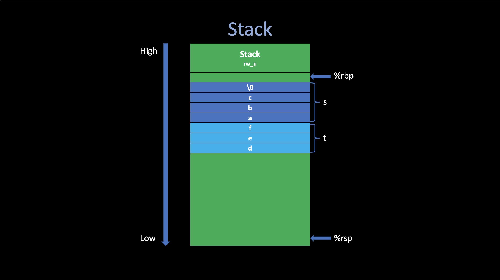
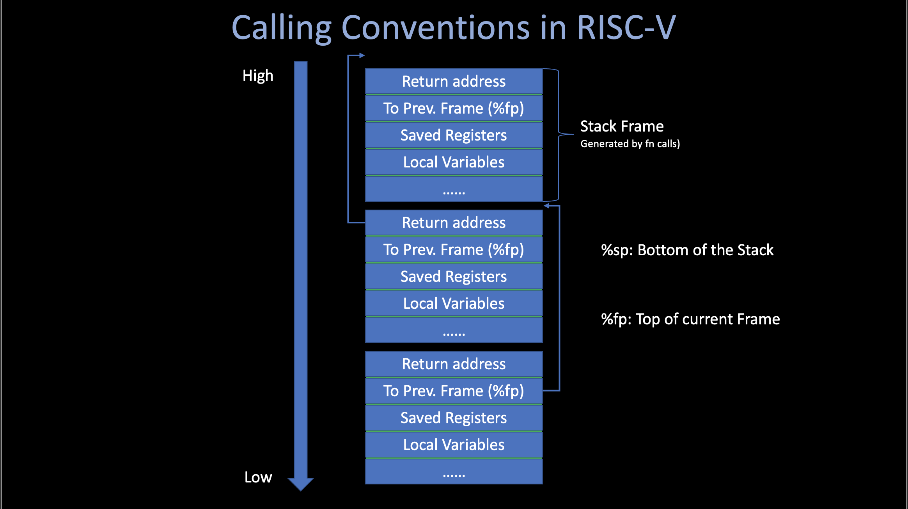

# The Rust Programming Language

##### Angold Wang | 2022-03-24

## 1. Why Rust? 

#### "Safe System Performance Programming"

* **System Programming Language:** _C, C++_.
* **Safe Programming Language:** _ML, Haskell, Java_

**Mozilla trying to blend the best of both of these languages**.

#### Why is Mozilla interested in creating a new programming language?
* Mozilla is the organization that created the Firefox web browser, current written in _C++_.
* **Web browsers need a high degree of control over the machine**.
    * Doing very complex tasks very quickly (all these tabs running simultaneously)
* **Web browsers need safety**
    * Running untrusted code, which is been downloaded from internet.
* **Languages like _C/C++_ that give you the kind of control you need in order to get the performance, but also leave you open to all kinds of security vulnerabilities.**
* Mozilla want to build the next generation web browser, which is a project called _[servo](https://github.com/servo/servo)_. And they wants to do it in a new language that tries to do better at giving you both **control** and **safety** at the same time.


## 2. Control - Case study: Zero-Cost Abstraction in C / C++

C and C++ is sort of the best existing language in this respect (control).

### i. Memory Allocation


Basically, there are **four** places in Memory for C/C++ program to store data.


#### 1. Stack

**Most of the temporary variables created at runtime are stored in the stack. They are created (push) when the corresponding procedure is called and destroyed (pop) when returns.**

Consider the following C code snippet:
```c
char s[] = "abc"; // {'a', 'b', 'c', 'd', '\n'}
char t[3] = "def";

printf("s: %s\n", s);
printf("t: %s\n", t);
```
The output of this process looks strange:
```
s: abc
t: defabc
```

After check the generated assembly code in **[char.s](./src/char.s)**, It is easy to figure out why **`t`** becomes **`defabc`**.

**Since `printf` only stops looking for the next byte when encounters `\0` (terminator).** If we do not define the variable with the correct format and size, because these temp data are stored in the stack, sometimes it will cause some unexpected errors.



#### 2. Text

**The Text segment has `e` bit enabled, the compiler generate program instructions in this segment. And this segment also hardcodes all "strings" that was defined inside the function.**

```asm
	.section	__TEXT,__cstring,cstring_literals
L___const.main.s:                       ## @__const.main.s
	.asciz	"abc"

	.section	__TEXT,__const
l___const.main.t:                       ## @__const.main.t
	.ascii	"def"
```


#### 3. Heap

**In C, the `malloc()` function will allocate a memory in Heap, and then return the begin address of that chunk of new memory.**

```c
char *p = malloc(6*sizeof(char));
strcpy(p, "strcpy");
printf("p: %s\n", p); // strcpy
```


#### 4. Data

**The Data segment contains global data. Which can be accessed from all functions in the current program.**
```asm
	.section	__DATA,__data
	.globl	_data                           ## @data
	.p2align	2
_data:
	.long	12345                           ## 0x3039

```


### ii. Calling Conventions

**The calling conventions describes the interface of the called code.** Which makes the caller code can find what they wants (arguments, return address, fp ,etc.)



There are two kinds of the registers in **Calling Conventions:** caller and callee saved.

#### Caller-Saved Registers
**Not preserved across the call.** These are scratch registers - the callee is allowed to scribble over them. **So if the caller cares about their contents, the caller must save them into stack before make the call.**

#### Callee-Saved Registers
**Preserved across the call.** If the callee uses them, then the callee must restore the original values before returning.

#### Usage of `%fp / %rbp`

Except for addressing variables in stack, the frame pointer (also called base pointer) are also used in **Back Trace.** Which can print the **calling stack** during the fn calling conventions
```c
void
backtrace(void) {
    uint64 cur_fp = r_fp();

    while (cur_fp != PGROUNDDOWN(cur_fp)) {   // Page top
	printf("%p\n", *(uint64 *)(cur_fp - 8));  // the return address
	cur_fp = *(uint64 *)(cur_fp - 16);        // next frame begin
    }
}

```

### iii. Zero-Cost Abstraction

When we say **"Control"** in programming language, it usually means **"How much control we can get over the machine?"**

For example, like what I mentioned earlier. If you declare a `vector` in C++ and you've read the `STL` code. You'll know exactly how that is going to be laid out in terms of the memory.

```c
vector<int> vec;
auto& elem = vec[0];
```
In particular, in this code snipper. There are some field of the vector, including a pointer to the actuall data in the heap and some metadata about it, that all live on the stack. And you can have a lot of controls over the layout if you want.


One of the principles that you get out of C++ is something often called **"Zero-cost abstraction".** Which means you can build libraries like `vector` or `string` that are reasonably convinence to use (they give you nice abstraction). **But if you compile it down. It is nothing different than you could have written by hand in assembly.** 

#### You're not giving up any performance in doing this abstraction


## 3. Design Patten

Here I'll show some design choices/pattens in Rust: Based on the book 《The Rust Programming Language》

### 0. Compiler Errors
In Rust, compiler errors can be frustrating and occur frequently, but really they only mean your program isn’t safely doing what you want it to do yet; they do not mean that you’re not a good programmer! Experienced Rustaceans still get compiler errors.

Even though these compile errors may be frustrating at times, remember that it’s the Rust compiler pointing out a potential bug early (at compile time rather than at runtime).

### 1. Mutability

**By default variables are immutable.** It’s important that we get compile-time errors when we attempt to change a value that’s designated as immutable because this very situation can lead to bugs.

If one part of our code operates on the assumption that a value will never change and another part of our code changes that value, it’s possible that the first part of the code won’t do what it was designed to do. The cause of this kind of bug can be difficult to track down after the fact, **especially when the second piece of code changes the value only sometimes.**

#### Shadowing

```rust
fn main() {
    let x = 5;

    let x = x + 1;

    {
        let x = x * 2;
        println!("The value of x in the inner scope is: {x}");
    }

    println!("The value of x is: {x}");
}
```

The first variable `x` is **shadowed** by the second, means that the second variable is what the compiler will see when you use the name of the variable in the inner scope. As a concequence:
1. We do not need to make a new temporary variable name (e.g., y) to use, we can reuse the same name efficiently.
2. By using `let`, we can perform a few operations on a value but have the variable immutable after those ops have been completed.

```
$ cargo run
   Compiling variables v0.1.0 (file:///projects/variables)
    Finished dev [unoptimized + debuginfo] target(s) in 0.31s
     Running `target/debug/variables`
The value of x in the inner scope is: 12
The value of x is: 6
```

### 2. Statements and Expressions

* **Statements** are instructions that perform some action and do not return a value.
* **Expressions** evaluate to a resulting value.

Expressions evaluate to a value and make up most of the rest of the code that you’ll write in Rust.

```rust
fn main() {
    let y = {
        let x = 3;
        x + 1
    };

    println!("The value of y is: {y}");
}
```

The block is an expression, in this case, evaluates to `4`. That value gets bound to `y` as part of the let statement. Note that the `x + 1` line doesn’t have a semicolon at the end, unlike most of the lines you’ve seen so far. **Expressions do not include ending semicolons**. If you add a semicolon to the end of an expression, you turn it into a statement, and it will then not return a value.

In Rust, the return value of the function is synonymous with the value of the final expression in the block of the body of a function.


### 3. Ownership

Ownership is a set of rules that governs how a Rust program manages memory. All programs have to manage the way they use a computer’s memory while running.

In general, there are three ways for programming language to free the unused memory:

1. **Explicitly allocate and free the memory.** (e.g,. C, C++)
2. **Using Garbage Collector that regularly looks for no-longer used memory as the program runs** (e.g,. Java, Go)
3. **Memory is managed through a system of ownership with a set of rules that the compiler checks. If all rules were followed, the code will be compiled successfully, and the compiler will help you do the deallocation automatically** (e.g,. Rust)

Genearally, In the first approach, it’s our responsibility to identify when memory is no longer being used and call code to explicitly free it, just as we did to request it. Doing this correctly has historically been a difficult programming problem. **If we forget, we’ll waste memory. If we do it too early, we’ll have an invalid variable. If we do it twice, that’s a bug too. We need to pair exactly one allocate with exactly one free.**

In the second approach, we do not need to think about the memory stuff, just keep creating the variables in the heap, and the Garbage Collector (GC) will help us to cleans up the memory that isn't being used anymore. The GC usually runs aside our program, and will slow it down due to the limited computer resources.

In Rust, the third approach, if we obey the rules of ownership and make the program compiled, **none of the features of ownership will slow down your program while it’s running, and you won't gain any both potential bugs and unreleased unused memory.**

#### The Ownership Rules

1. **Each value in Rust has an owner.**
2. **There can only be one owner at a time.**
3. When the owner goes out of scope, the value will be dropped automatically

```rust
    let s1 = String::from("hello");
    let s2 = s1;                   // s2 now own the value of s1

    println!("{}, world!", s1);    // compile error
    // the value is being "moved" from s1 to s2
    // the s1 has been invalidated
```

If you’ve heard the terms *shallow copy* and *deep copy* while working with other languages, the concept of copying the pointer, length, and capacity without copying the data probably sounds like making a shallow copy. But because Rust also **invalidates the first variable, instead of calling it a shallow copy, it’s known as a move**. In this example, we would say that **`s1`** was moved into **`s2`**. So what actually happens is shown in the following Figure.


#### Why do we need Ownership?

One of the purpose of the ownership rule is to solve some problems that we usually encounter in Type #1 language like C and C++:  **The Double Free Error**

When a variable goes out of scope, **Rust automatically calls the drop function and cleans up the heap memory for that variable.** But if both data pointers pointing to the same location. This is a problem: when s2 and s1 go out of scope, they will both try to free the same memory. This is known as a double free error and is one of the memory safety bugs we mentioned previously. Freeing memory twice can lead to memory corruption, which can potentially lead to security vulnerabilities.


### 4. Borrowing

Sometimes, after calling a function and give the ownership of that variable to it, we may stll want to use that variable after the function return. (that variable should not be invalidated). The solution is that **we can provide a reference to that variable, when we pass that reference, there is no ownership transfer**, which means that **the function just "borrow" the value of that variable** (do not own it).

A *reference* is like a pointer in that it’s an address we can follow to access the data stored at that address; that data is owned by some other variable. Unlike a pointer, **a reference is guaranteed to point to a valid value of a particular type for the life of that reference**. (the memory should not be dropped.)

Here is how you would define and use a `calculate_length` function that has a reference to an object as a parameter instead of taking ownership of the value:
```rust
fn main() {
    let s1 = String::from("hello");

    let len = calculate_length(&s1);

    println!("The length of '{}' is {}.", s1, len);
}

fn calculate_length(s: &String) -> usize {
    s.len()
} // Here, s goes out of scope. But because it does not have ownership of what
  // it refers to, it is not dropped.
```


#### Mutable References

Just as variables are immutable by default, so are references. We’re not allowed to modify something we have a reference to. But you can also create a mutable reference by adding a `mut` keyword:

```rust
fn main() {
    let mut s = String::from("hello");

    change(&mut s);
}

fn change(some_string: &mut String) {
    some_string.push_str(", world");
}
```

Mutable references have one big restriction: **if you have a mutable reference to a value, you can have no other references to that value.** This code that attempts to create two mutable references to s will fail. 

The benefit of having this restriction is that Rust can **prevent data races at compile time**. A data race is similar to a race condition and happens when these three behaviors occur:

1. Two or more pointers access the same data at the same time.
2. At least one of the pointers is being used to write to the data.
3. There’s no mechanism being used to synchronize access to the data.

Data races cause undefined behavior and can be difficult to diagnose and fix when you’re trying to track them down at runtime; Rust prevents this problem by refusing to compile code with data races!

Another restriction of mutable reference is that **We also cannot have a mutable reference while we have an immutable one to the same value.**

The reason is also relatively simple: Users of an immutable reference **don’t expect the value to suddenly change out from under them!**

```rust
    let mut s = String::from("hello");

    let r1 = &s; // no problem
    let r2 = &s; // no problem
    println!("{} and {}", r1, r2);
    // variables r1 and r2 will not be used after this point

    let r3 = &mut s; // no problem
    println!("{}", r3);
```

The scopes of the immutable references `r1` and `r2` end after the `println!` where they are last used, which is before the mutable reference `r3` is created. These scopes don’t overlap, so this code is allowed.

