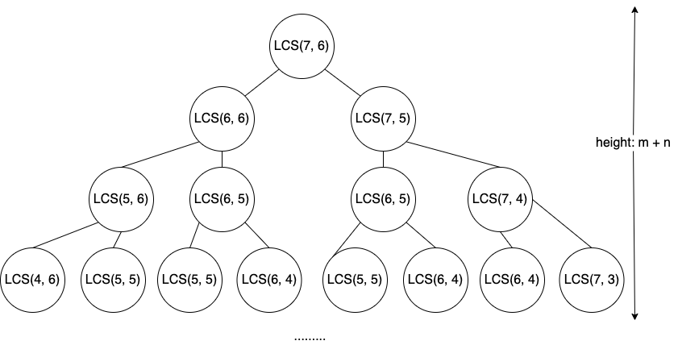
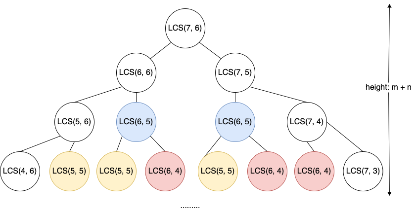

# Dynamic Programming

## 0. Intro: The LCS Problem

### Problem
**Given two sequences: $x[1...m]$ and $y[1...n]$, find a longest common subsequence for both.** 

### Example
$$x: A B C B D A B$$
$$y: B D C A B A$$

The **`LCS(x, y)`** are $BDAB$, $BCAB$ and $BCBA$.


### Approaches

#### (1) Brute Force

Check every subsequence of $x[1...m]$ to see if it is also a common subsequence of $y[1...n]$.

1. To Find all subsequence of x...
    * By building a bitmap of x.
    * **The time complexity would be $O(2^m)$**
2. To check whether a subsequence of x, is also a subseq of y...
    * By scanning y each time.
    * **The time complexity for this checking $O(n)$**
3. The Time Complexity of this Brute Force impl would be...
    * **Exponential time: $O(n \times 2^m)$**

#### (2) The Recursive Approach

Consider only prefixes of x and y.

Define $C[i...j] = | LCS(x[1...i], y[1...j]) |$, and calculate $C[i...j]$ for all i, j.
Then $LCS(x, y) = C[m, n]$.

Then We have a **theorem**:

$$
  C[i, j] =
\begin{cases}
C[i-1, j-1] + 1,  & \text{if x[i] = y[i]} \\
max\{C[i-1,j], C[i,j-1]\}, & \text{otherwise}
\end{cases}
$$


Now let's prove this theorem: (only case 1)

1. Let $z[1...k] = LCS(x[1...i], y[1...j])$, where $c[i,j] = k$. 
2. Then $z[k] = x[i] = y[j]$ or else $z$ could be extended by taking on $x[i]$.
3. Thus, $z[1...k-1]$ is a common subsequence(CS) of $x[1...i-1]$ and $y[1...j-1]$.
4. Claim that $z[1...k-1] = LCS(x[1...i-1], y[1...j-1])$.
    * Suppose w is a longer CS, that is, $|w| \gt k-1$.
    * Then we make w **concatinate** with $z[k]$, we call this new string $wk$.
    * $wk$ is a CS of $x[1...i]$ and $y[1...j]$ with length bigger than k. And that is a contradiction.
5. Thus, $C[i-1, j-1] = k-1$, which implies $C[i, j] = C[i-1,j-1] + 1$.


* **Dynamic Programming Hallmark #1**: **The Optimal Structure:** 
    * An optimal solution to a problem (instance), contains optimal solutions to subproblems.
    * There is a optimal substructure going on in the problem.
    * In LCS example, If $z = LCS(x,y)$ then any prefix of $z$ is a LCS of a prefix of $x$ and a prefix of $y$.

Now let's try to analyze the time complexity of this recursive approach:

Let's say we want to find the LCS of two strings $x$ and $y$, with length $m = 7$, $n = 6$. Then we have the following recursion tree, and assume it is in the worst case, which each recursive subproblem belongs to case 2 (with two subproblems):



It is not hard to get the height of this recursion tree: $m + n$. Since its is a binary tree, the **time complexity would be $O(2^{m+n})$, which is also exponential!.**

#### (3) The Memoization Approach

The main reason that recursive approach is slow, is that we do a lot of repeated works. As you can see in the tree, all the colored nodes are being calculated more than once. 



* **Dynamic Programming Hallmark #2**: **Overlapping Subproblems:**
    * A recursive solution contains a small number of distinct subproblmes, repeated many times.
    * **In LCS example, for $LCS(m,n)$, actually we only have $m \times n$ distinct subproblems.**

**The Memoization Algorithm:**

```
LCS(x, y, i, j)
    if c[i, j] = nil
        then if x[i] = y[i]
            then c[i, j] = LCS(x, y, i-1, j-1) + 1
            else c[i, j] = max{LCS(x, y, i, j-1)
                               LCS(x, y, i-1, j)}
    return c[i][j]
```

* **Time Complexity: $\theta(m \times n)$**
* **Space Complexity: $\theta(m \times n)$**

### Idea of DP

And that is called **Dynamic Programming**: To compute the table ($C$ here) bottom-up.

Or in other words, **We start with a relatively smaller subproblem, and then using its answer to calculate bigger problem... till we reach the question we actually need to solve.**

## 1. Dynamic Programming
We can think Dynamic Programming as kind of **exhausive search**, which is usually a bad thing to do, because it leads to exponential time. But if you do it in a clever way, via dynamic programming, you typically get **polynomial time**.

**Dynamic Programing** $\approx$ "**Careful Brute Force**"

**Dynamic Programming $=$ A Buttom-up approach.**

